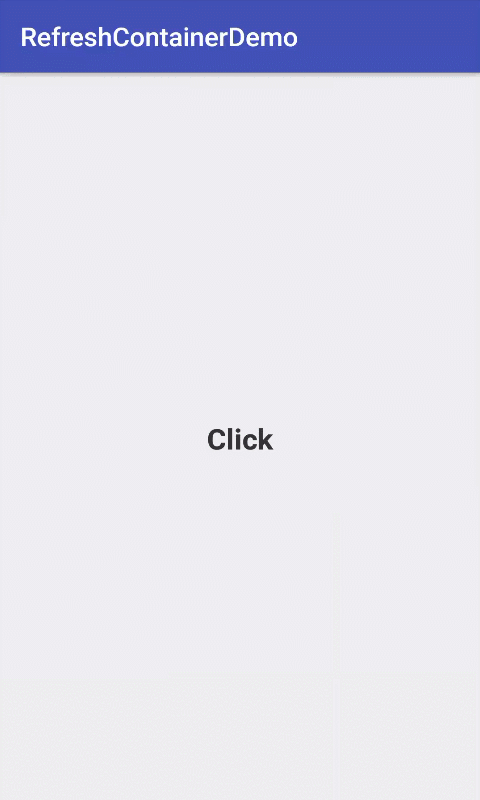
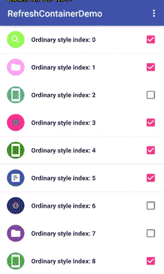
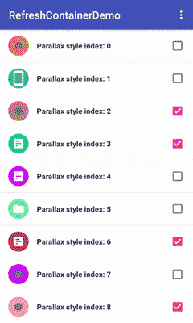
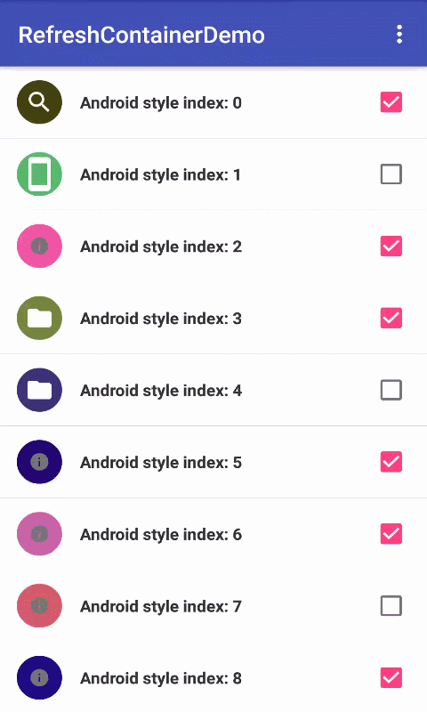
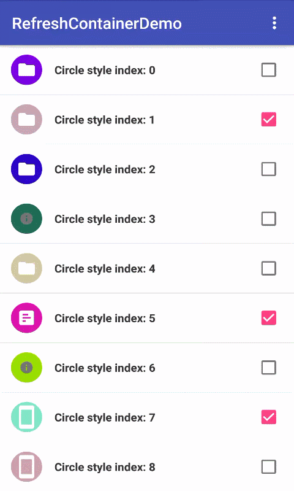

# RefreshContainer
RefreshContainer 是一个可以为任意 View 提供垂直方向上的刷新和加载更多能力的容器，
仅支持一个直接子 View(Content view)。
与其他已有的刷新控件最大不同为刷新风格和刷新时展示的 View 均可自定义。

通过 IRefreshView 获得本控件的刷新状态信息来更新自定义的刷新和加载 view 中的状态。
使用时注意不要用 addView 的方法添加 view，使用 setRefreshView(View)、setLoadMoreView(View)、
setContentView(View) 设置的 view 才会被布局。ContentView 亦可在 xml 文件中以直接子元素的形式设置
注意一定要调用 execute() 使所有配置生效。

The RefreshContainer can customize your refresh style and refresh view, see
IRefreshStyle, IRefreshView.

The RefreshContainer should be used whenever the user can refresh and/or load the
contents of a view via a vertical swipe gesture. This container should be made
the parent of the view that will be refreshed as a result of the gesture and
can only support one direct child.The activity that instantiates this view should
add an IRefreshLoadMoreCallback to be notified whenever the swipe to refresh or
load gesture is completed.

**NOTICE:** You must call **execute()** bring into effect.

# How it looks

	
	

	
	
	

- Circle : [https://github.com/tuesda/CircleRefreshLayout](https://github.com/tuesda/CircleRefreshLayout)
- Fly : [https://github.com/race604/FlyRefresh](https://github.com/race604/FlyRefresh)

# Features
...

# How to use
...

# License
Apache-2.0