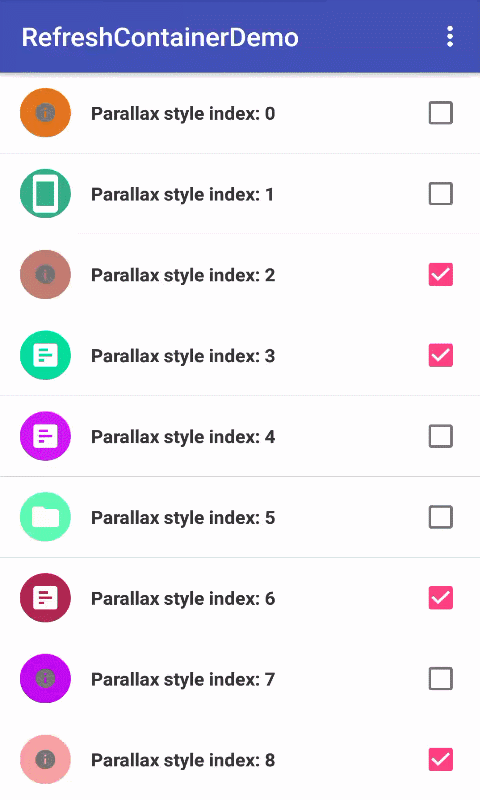

# RefreshContainer
RefreshContainer 是一个可以为任意 View 提供垂直方向上的刷新和加载更多能力的容器，
可自定义任意刷新风格(包括视图和交互逻辑)。

The RefreshContainer is An awesome widget provide refresh and
load capabilities for any view, you can customize any style.

# How it looks
<div align=center>
	
	
</div>

<div>
	
	
	
</div>

- Circle : [https://github.com/tuesda/CircleRefreshLayout](https://github.com/tuesda/CircleRefreshLayout)
- Fly : [https://github.com/race604/FlyRefresh](https://github.com/race604/FlyRefresh)

# Features
- Support refresh and load more
- Support customize any interact style
- Support customize refresh view and load more view
- Support nested scroll
- Work with any view

# How to use
Add Gradle dependency:
```
dependencies {
    compile 'com.krt:refreshcontainerlib:1.0.2'
}
```
An example of basic usage in `layout.xml`:
```
<?xml version="1.0" encoding="utf-8"?>
<com.krt.refreshcontainerlib.RefreshContainer xmlns:android="http://schemas.android.com/apk/res/android"
    android:layout_width="match_parent"
    android:layout_height="match_parent">

    <Any view
        android:layout_width="match_parent"
        android:layout_height="match_parent"
        android:background="#FFF" /><!--Maybe you need cover your refresh view, e.g. parallax style-->

</com.krt.refreshcontainerlib.RefreshContainer>
```
Configure:
```
    mRefreshContainer = (RefreshContainer) findViewById(R.id.refresh_container);
    mRefreshContainer.setDuration(320)
//            .setRefreshChecker(IRefreshChecker) //If child view unsupported nested scroll, uncomment this line.
            .setRefreshLoadMoreCallback(new IRefreshLoadMoreCallback() {
                public void onRefresh() { do refresh }
                public void onLoadMore() { do load more }
            })
            .setRefreshView(IRefreshView)
            .setLoadMoreView(IRefreshView)
            .setRefreshStyle(IRefreshStyle)
            .execute(); //Very important!! Just execute configuration, not refresh
```
When work complete or be canceled:
```
mRefreshContainer.setWorkCompleted();
```
For more, please turn to the source code.


# License
`RefreshContainer` is available under the Apache-2.0 license.